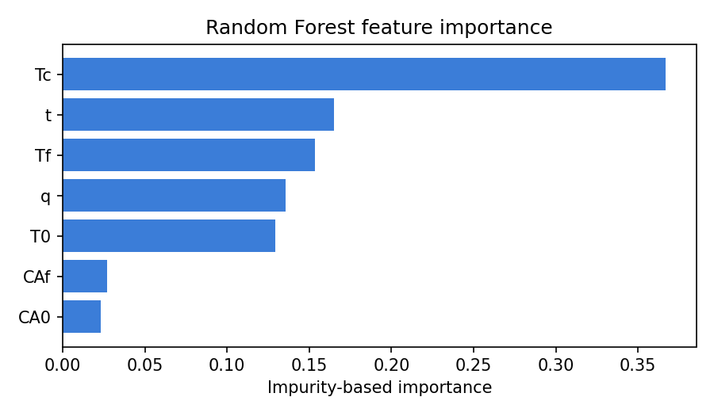
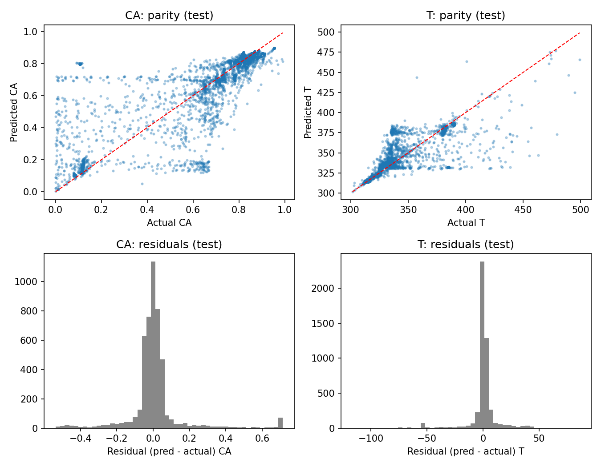
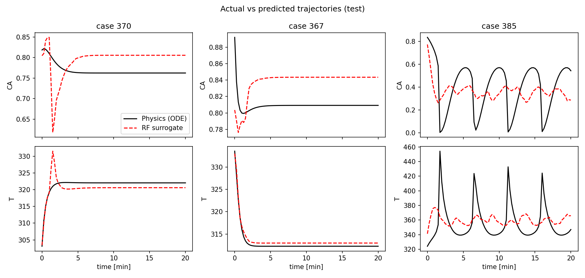
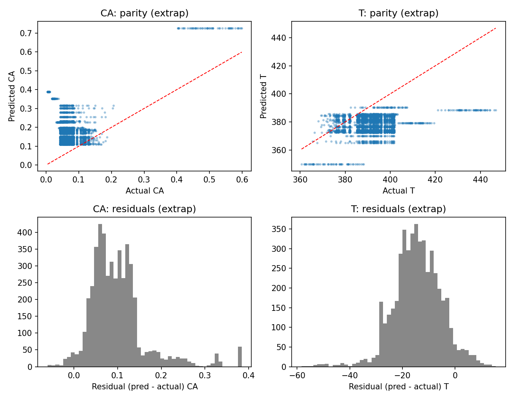
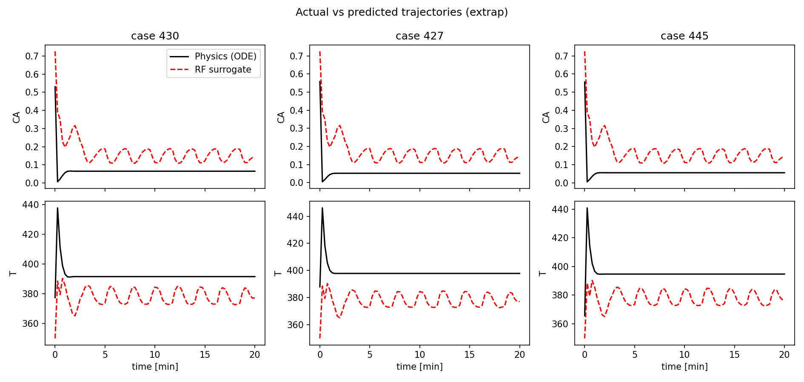

# CSTR Modeling - ML Surrogate

**Core concepts:** numerical simulation, Random Forest, ML surrogate modeling, digital twin.

A physics-based Continuous Stirred-Tank Reactor (CSTR) is simulated by solving ODE reaction
models in Python. The simulated process data is used to train a Random Forest surrogate that
predicts reactor states. The surrogate is compared against the physics model on accuracy,
generalisation and computation time, and explored in a Streamlit dashboard.

---

## Contents
1. [Project structure and how to run](#1-project-structure-and-how-to-run)
2. [The physics model](#2-the-physics-model)
3. [Dataset and experimental design](#3-dataset-and-experimental-design)
4. [Random Forest explained](#4-random-forest-explained)
5. [Evaluation metrics](#5-evaluation-metrics)
6. [Results and figure-by-figure explanation](#6-results-and-figure-by-figure-explanation)
7. [Dashboard and computation-time benchmark](#7-dashboard-and-computation-time-benchmark)
8. [Limitations](#8-limitations)
9. [Next steps](#9-next-steps)

---

## 1. Project structure and how to run

```
src/cstr_model.py       ODE model (first-order exothermic A -> B, cooling jacket), solved with solve_ivp (LSODA)
src/generate_data.py    Simulates trajectories over varied operating conditions -> data/cstr_dataset.csv
src/train_surrogate.py  Random Forest: (t, CA0, T0, Tc, q, CAf, Tf) -> (CA, T); saves model + feature importance
src/evaluate.py         MAE / RMSE / R2, residuals, trajectory plots, timing benchmark -> results/
app/streamlit_app.py    Dashboard comparing physics vs ML with sliders for operating conditions
run_pipeline.py         generate -> train -> evaluate
```

```bash
python -m venv venv && source venv/bin/activate      # Windows: venv\Scripts\activate
pip install -r requirements.txt
python run_pipeline.py                               # data, model, metrics, figures (results/)
streamlit run app/streamlit_app.py                   # dashboard at http://localhost:8501
```

Run everything from the project root (the folder containing `run_pipeline.py`).

Outputs: `data/cstr_dataset.csv`, `models/rf_surrogate.joblib`, `results/metrics.json`,
`results/feature_importance.csv`, and figures in `results/figures/`.

---

## 2. The physics model

A CSTR is a tank with continuous feed in and product out, perfectly mixed so that the contents
have the same composition and temperature as the outlet. Here, a first-order exothermic
reaction A -> B takes place, with a cooling jacket removing heat.

**States** (what we predict)
- `CA` - concentration of reactant A [mol/L]
- `T` - reactor temperature [K]

**Inputs / operating conditions** (what we vary)
- `q` feed flow [L/min], `CAf` feed concentration [mol/L], `Tf` feed temperature [K]
- `Tc` coolant temperature [K]
- `CA0`, `T0` - initial state at t = 0

**Equations** (mass and energy balance, Arrhenius kinetics k = k0 exp(-E/RT)):

```
dCA/dt = (q/V)(CAf - CA) - k0 exp(-E/(R T)) CA
dT/dt  = (q/V)(Tf - T) + (-dHr)/(rho Cp) k0 exp(-E/(R T)) CA + UA/(V rho Cp) (Tc - T)
```

| Parameter | Value | Meaning |
|---|---|---|
| V | 100 L | reactor volume |
| rho*Cp | 239 J/(L K) | volumetric heat capacity |
| dHr | -5.0e4 J/mol | heat of reaction (exothermic) |
| E/R | 8750 K | activation energy / gas constant |
| k0 | 7.2e10 1/min | pre-exponential factor |
| UA | 5.0e4 J/(min K) | heat-transfer coefficient x area |

**Why this system is hard for ML.** Because the reaction is exothermic and the rate rises
exponentially with temperature, the reactor is *nonlinear* and can show:
- **multiple steady states** (a cold, low-conversion state and a hot, high-conversion state),
- **ignition / extinction** (a small change in inputs flips the reactor to the other state),
- **sustained oscillations** (limit cycles: repeated temperature spikes).

The residence time is V/q, about 1 min here, so the reactor "forgets" its initial concentration
quickly. These regimes are what make the figures below look the way they do.

---

## 3. Dataset and experimental design

For every sampled operating condition the ODEs are integrated for 20 min and recorded at 81
time points (every 0.25 min). One row = one (case, time) pair.

- **460 trajectories, 37,260 rows** in total.
- **Splits are made per operating condition (case), not per row.** If rows from the same
  trajectory were spread across train and test, the model would see near-copies of its test
  data (leakage) and results would look unrealistically good.

| Split | Cases | Purpose |
|---|---|---|
| train | 280 | fit the Random Forest |
| val | 60 | in-distribution check |
| test | 60 | final in-distribution evaluation |
| extrap | 60 | **unseen operating conditions**, sampled from a shifted range never used in training |

Sampling ranges (uniform):

| Variable | Nominal (train/val/test) | Extrapolation |
|---|---|---|
| CA0 [mol/L] | 0.6 - 1.0 | 0.4 - 0.6 |
| T0 [K] | 300 - 360 | 360 - 390 |
| Tc [K] | 295 - 310 | 310 - 320 |
| q [L/min] | 80 - 120 | 120 - 150 |
| CAf [mol/L] | 0.85 - 1.0 | 0.70 - 0.85 |
| Tf [K] | 335 - 355 | 355 - 370 |

Every extrapolation variable lies outside its training range, which is a deliberately hard test.

---

## 4. Random Forest explained

### 4.1 Decision tree
A regression tree repeatedly splits the data with yes/no questions on one feature
(e.g. "Tc < 303 K?", "t < 1.5 min?"), choosing at each step the split that most reduces the
squared error of the target. It stops at a *leaf*, and the prediction of a leaf is the
**average target value of the training rows that fell into it**.

### 4.2 Random Forest = many trees, averaged
A Random Forest trains many trees, each on
1. a **bootstrap sample** (random rows drawn with replacement), and
2. a **random subset of features** considered at each split.

Each tree is therefore different and individually noisy. Averaging their predictions
(**bagging**) cancels much of the noise: variance drops while bias stays about the same.
This makes forests robust, hard to badly overfit, and nearly tuning-free.

### 4.3 How it is used in this project
- **Inputs (7 features):** `t, CA0, T0, Tc, q, CAf, Tf`
- **Outputs (2):** `CA(t)` and `T(t)` - one multi-output forest predicts both states together
- **Formulation:** a *direct* surrogate. Given operating conditions and a time `t`, it returns
  the state at that time in one shot - it does not step through time.
- **Hyper-parameters:** `n_estimators=200`, `min_samples_leaf=2`, `random_state=0`, `n_jobs=-1`
- **No feature scaling** is needed (trees are invariant to monotonic transforms).

### 4.4 Strengths
- Captures nonlinear behaviour and interactions without a hand-written model form.
- Very fast to train, robust, few hyper-parameters.
- Gives feature importances for quick interpretation.

### 4.5 Weaknesses (these explain most of the results)
- **Cannot extrapolate.** Predictions are averages of training targets, so they are piecewise
  constant and always stay inside the range seen in training. Outside the training envelope the
  forest simply reuses its closest leaves.
- **Regresses to the mean.** It minimises squared error, so when the true outcome is uncertain
  (e.g. an oscillation whose phase depends sensitively on inputs) it outputs an average.
- **No notion of dynamics.** Each time point is predicted independently, so there is no
  guarantee of smooth or physically consistent trajectories.
- **Regime errors are large.** When a case sits near an ignition/extinction boundary, the
  forest may pick the wrong branch and be off by a lot.
- **Multi-output caveat:** scikit-learn's multi-output trees sum the squared errors of all
  outputs *without scaling*. T varies over hundreds of K^2 while CA varies over ~0.1, so
  temperature dominates the split choice. Standardising targets or fitting one forest per
  state is a simple improvement.
- **Heavy for single predictions:** 200 trees plus Python overhead cost more than solving a
  2-state ODE (see section 7).

### 4.6 Feature importance
`feature_importances_` is the impurity-based importance (mean decrease in impurity): how much
each feature reduced the squared error across all splits in all trees, normalised to sum to 1.
It is a quick guide, but it is biased toward continuous features with many distinct values,
is affected by the sampled range of each variable, and does **not** imply causation.
Permutation importance is a more reliable check (see next steps).

---

## 5. Evaluation metrics

With actual values y, predictions y-hat, mean y-bar and n points:

- **MAE** = mean(|y - y-hat|) - the typical error in the variable's own unit (mol/L for CA, K for T).
- **RMSE** = sqrt(mean((y - y-hat)^2)) - like MAE but squares errors first, so **large errors
  count much more**. RMSE much larger than MAE means a heavy tail of big mistakes.
- **R^2** = 1 - sum((y - y-hat)^2) / sum((y - y-bar)^2) - the fraction of variance explained.
  1 = perfect, 0 = no better than always predicting the mean, **negative = worse than
  predicting the mean**. R^2 is relative to the spread of the data, so it is harsh on a
  dataset where the true values vary little (as in the extrapolation set).

---

## 6. Results and figure-by-figure explanation

### 6.1 Overall metrics

MAE from a local run (the dashboard's "Offline evaluation" table):

| Split | State | MAE |
|---|---|---|
| train | CA | 0.0089 |
| train | T | 0.8195 |
| val | CA | 0.0550 |
| val | T | 3.9948 |
| test | CA | 0.0737 |
| test | T | 5.9776 |
| extrap | CA | 0.0998 |
| extrap | T | 14.8351 |

The full MAE / RMSE / R^2 table is in `results/metrics.json`. In the reference run R^2 was about
0.98 (train), about 0.7 (val/test) and negative (extrap). Small differences between machines are
normal: library versions and floating-point details change the simulated dataset slightly, and
trajectories near regime boundaries are sensitive to that.

**Reading the table**
- **Train -> test gap** (MAE of T: 0.8 K -> 6.0 K): the model fits data it has seen far better
  than new operating conditions. Part of this is inherent to forests (training rows are fitted
  closely) and part is the difficult, regime-switching physics.
- **Test -> extrap** (T: 6.0 K -> 14.8 K): performance drops again on unseen operating
  conditions - the forest cannot extrapolate.
- The extrap R^2 is strongly negative partly because the extrap targets have small variance
  (most trajectories settle near the same hot steady state), so even moderate errors are large
  relative to the spread.

### 6.2 `feature_importance.png`



| Feature | Importance | Interpretation |
|---|---|---|
| Tc | ~0.37 | Coolant temperature sets the heat removal, which largely decides which steady state (cold / hot / oscillating) the reactor ends in. |
| t | ~0.17 | The state evolves in time, so time is needed to place a point in the transient. |
| Tf | ~0.15 | Feed temperature sets the incoming heat, which also shifts the regime. |
| q | ~0.14 | Flow sets the residence time (V/q) and the heat removal by convection. |
| T0 | ~0.13 | The initial temperature can push the reactor across the ignition threshold. |
| CAf | ~0.03 | Only varies over a narrow range (0.85-1.0) and mainly scales the outcome. |
| CA0 | ~0.02 | Initial concentration is washed out in about 1 residence time (~1 min). |

Takeaway: the temperature-related inputs dominate, as expected for a thermally driven reactor.
The small importance of CA0 and CAf partly reflects their narrow sampled range, not only physics.

### 6.3 `parity_residuals_test.png` (unseen cases, same operating envelope)



*Top row - parity plots.* Each dot is one (case, time) point: actual value on x, prediction on y.
Points on the red dashed diagonal are perfect predictions.

- **CA:** a dense cluster along the diagonal at high CA (about 0.8-0.9, the low-conversion
  branch) and another near 0.1-0.15 (high-conversion branch) - the forest identifies the two main
  steady states well. Horizontal and vertical streaks away from the diagonal are cases where the
  forest assigned the wrong regime (for example predicting ~0.7 when the true value is anywhere
  from 0 to 0.6) or where the true trajectory oscillates through many values.
- **T:** points hug the diagonal at 310-340 K (cold branch) and 380-390 K. At high actual
  temperatures (above ~420 K) predictions fall below the diagonal: those are the sharp
  temperature spikes of ignition/oscillation, and an averaging model underestimates extremes.

*Bottom row - residual histograms (prediction minus actual).*
- Both are sharply peaked at zero: **most points are predicted accurately**.
- Both have **long, heavy tails** (CA up to +/-0.5-0.7, T down to about -100 K). These are the
  regime mistakes. This is why RMSE is much larger than MAE and R^2 is only about 0.7 even though
  the median error is small.

### 6.4 `trajectories_test.png`



Black = physics (ODE, ground truth), red dashed = Random Forest.

- **Cases 370 and 367 (settling reactors).** The forest reproduces the shape and the final
  steady state closely (T within about 1-2 K, CA within about 0.03-0.04). Two artefacts:
  a small **steady-state offset** (average error of leaves) and a **short wiggle around 1-2 min**.
  The wiggle appears because each time step is predicted independently from piecewise-constant
  leaves, so there is no smoothness constraint.
- **Case 385 (oscillating reactor).** The physics shows sustained **relaxation oscillations**:
  temperature spikes to about 450 K roughly every 4.7 min while CA crashes to near zero. The forest
  predicts a small, irregular wiggle around the mean (CA about 0.35, T about 360 K). This is the
  classic regression-to-the-mean failure: the exact phase of the oscillation is very sensitive to
  inputs, so the best squared-error guess is the average, which erases the oscillation.

### 6.5 `parity_residuals_extrap.png` (unseen operating conditions)



- **CA parity:** actual CA is mostly 0.03-0.2 (high conversion), but predictions sit at 0.1-0.4 -
  the forest never predicts values that low here. The row of points at actual CA 0.4-0.6 all
  receive the same prediction of about 0.72: those are the t = 0 points whose initial
  concentration (CA0 0.4-0.6) is **below the training range** (0.6-1.0). The forest can only
  return the closest value it has seen, about 0.72, so predictions **saturate**.
- **T parity:** predictions are confined to about 350-390 K while actual values reach 447 K.
  Again the flat, banded look is the piecewise-constant tree structure hitting the edge of the
  training data.
- **Residuals:** unlike the test set, these are **not centred on zero**. CA is over-predicted by
  about +0.1 and T is under-predicted by about -15 to -20 K. That is a **systematic bias**,
  the signature of extrapolation, not random noise.

### 6.6 `trajectories_extrap.png`



- **Physics:** a fast transient (temperature spike to about 440 K in the first minute) followed by
  a smooth settling to a hot, high-conversion steady state (T about 392-398 K, CA about 0.05-0.065).
- **Surrogate:** wrong starting values (CA about 0.72 instead of about 0.55, T = 350 K instead of
  365-378 K), then **spurious sustained oscillations** roughly every 2 min that the real reactor
  does not have, around a mean far from the true steady state.
- **The three red curves are identical** even though the three cases have different inputs. That
  is strong evidence of extrapolation: all the inputs fall beyond the edge of the training data, get
  routed to the same leaves, and only `t` changes the output. The oscillations are therefore an
  artefact of the tree partition in `t`, not a physical prediction.
- Note the recording step is 0.25 min, so the fast spike is only captured by a couple of points.

**Main conclusion of the figures:** the Random Forest is a good *interpolator* in the region it
was trained on (see settling cases) and a poor *extrapolator*; it also struggles with
regime-switching and oscillating behaviour.

---

## 7. Dashboard and computation-time benchmark

`streamlit run app/streamlit_app.py` shows, for the chosen operating conditions:
- MAE and RMSE of CA and T for that single trajectory,
- physics vs surrogate trajectories and the error curves,
- the wall-clock time of each, and the offline evaluation table and figures.

Example (default centre-of-range sliders: CA0 0.80, T0 330 K, Tc 302.5 K, q 100 L/min,
CAf 0.93, Tf 345 K):
- MAE(CA) = 0.0157, MAE(T) = 0.43 K; RMSE(CA) = 0.0160, RMSE(T) = 0.46 K. The error curves show
  a small **constant steady-state offset** (about +0.016 mol/L and about -0.4 K) after a short
  initial transient error. Inside the training region the surrogate is accurate.
- Timing: physics 3.84 ms vs surrogate 41.63 ms, i.e. a "speed-up" of 0.1x - the surrogate is
  about **10x slower** for one trajectory.

**Why the surrogate is slower here**
1. The physics model is tiny (2 states, smooth, solved by LSODA in a few milliseconds), so there
   is almost nothing to speed up.
2. Predicting one 81-row trajectory with 200 trees has fixed overhead: thread-pool start-up
   (`n_jobs=-1`), input validation and DataFrame construction, and the first call in the dashboard
   also pays a cold-start cost.
3. Surrogates pay off for **expensive** simulators (large PDE/CFD models taking seconds to hours)
   and for **many-query** workloads (optimisation, uncertainty quantification, real-time
   digital-twin loops). `results/metrics.json` shows that predicting many trajectories in one
   batch is faster than the ODE solver (about 3.7x for 60 cases in the reference run).

**Quick speed fixes** (accuracy unchanged):
```python
rf = joblib.load("models/rf_surrogate.joblib")
rf.set_params(n_jobs=1)              # avoid thread-pool overhead for small inputs
y = rf.predict(X.to_numpy())         # avoid DataFrame overhead
```
Fewer trees (e.g. 50-100) also reduce time roughly linearly.

**Accuracy-speed trade-off documented by this project:** on this toy problem the surrogate is
less accurate than physics outside its training range and not faster for a single case. The
value of the exercise is the workflow (data generation, validation on unseen and out-of-range
conditions, error analysis, benchmarking), which carries over to expensive models where a
surrogate does pay off.

---

## 8. Limitations
- Toy 2-state model with textbook parameters; not calibrated to a real plant.
- Constant inputs per trajectory (no step changes or control actions), so it is not yet a full
  dynamic digital twin.
- Single random split and seed; results vary a little between machines and seeds.
- The Random Forest cannot extrapolate, averages over uncertain regimes and has no dynamics.
- Unscaled multi-output targets bias tree splits toward temperature.
- Impurity-based feature importance is only indicative.

## 9. Next steps
1. **Scale the targets** (standardise CA and T) or fit one model per state.
2. **Add physics-informed features:** residence time V/q, a Damkohler-like number
   (k(T) * V/q), and the heat-removal ratio.
3. **Learn dynamics instead of trajectories:** predict the change over one step from the current
   state (x_{t+1} = f(x_t, inputs)) and roll out, which can represent oscillations and extend to
   changing inputs.
4. **Regime classification first:** classify steady vs oscillatory, then use a specialist
   regressor per regime.
5. **Other models:** gradient boosting, an MLP, or Gaussian process; a hybrid model (physics plus
   an ML correction of its residual) generalises better outside the training range.
6. **Uncertainty:** quantile regression forests or an ensemble spread to flag when the surrogate
   is out of its range.
7. **Wider and denser training design** (Latin hypercube sampling, wider envelope) and a finer or
   log-spaced time grid for the fast initial transient.
8. **Permutation importance** and SHAP for more reliable interpretation.
9. **Repeated runs** over several seeds with mean +/- std for reported metrics.
